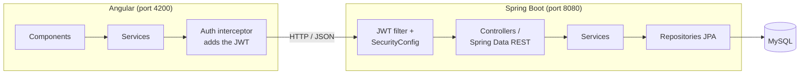

# ecommerce-fullstack

A full stack e-commerce application: a Spring Boot REST API and an Angular front end, backed by MySQL. Customers browse and search the catalog, fill a cart and place orders. Registered users log in with a JWT and see their order history, and admins manage products and orders from a dedicated area.

## Credits and my contributions

The base of this project (catalog, search, pagination, cart, checkout form and order saving) comes from the course **[Full Stack: Angular and Spring Boot](https://github.com/darbyluv2code/fullstack-angular-and-springboot)** by Chad Darby (luv2code), release 2.0.

On top of it, I added:

- **Authentication:** sign up and log in with Spring Security and JWT, BCrypt-hashed passwords, USER and ADMIN roles.
- **Admin area:** product management (list, search, create, edit, delete) and order management (list, change status), restricted to the ADMIN role on the backend and hidden by a route guard on the frontend.
- **My orders:** logged-in customers see their own orders.
- **Checkout hardening:** prices and totals are recomputed on the server from the database instead of being trusted from the browser, an existing customer is reused instead of duplicated, and new orders get the NEW status.
- **API safety:** customers, orders and users are no longer exposed by Spring Data REST, validation errors return clear JSON messages.
- **Integration tests:** security rules, authentication, admin CRUD and orders are tested end to end with MockMvc and an in-memory H2 database.
- **Configuration:** database, JWT secret and admin account come from environment variables, and a Docker Compose file starts MySQL with the schema and sample data.

## Architecture



| Layer | Technology |
|---|---|
| Front end | Angular 14, TypeScript, Bootstrap, ng-bootstrap |
| Back end | Java 17, Spring Boot 2.7, Spring Data JPA/REST, Spring Security |
| Auth | JWT (jjwt), BCrypt |
| Database | MySQL 8 (Docker Compose for local dev, H2 for tests) |

**How a request flows:** an Angular component calls a service, the interceptor adds the JWT, Spring Security checks the token and the role, the controller calls a service, the service uses a JPA repository, and the result goes back as JSON.

## Main API routes

| Method | Route | Access |
|---|---|---|
| GET | `/api/products`, `/api/product-category` | Public |
| POST | `/api/auth/register`, `/api/auth/login` | Public |
| POST | `/api/checkout/purchase` | Public (linked to the account when logged in) |
| GET | `/api/auth/me`, `/api/orders/me` | Logged-in user |
| GET, POST, PUT, DELETE | `/api/admin/products` | ADMIN |
| GET, PUT | `/api/admin/orders`, `/api/admin/orders/{id}/status` | ADMIN |

## Project structure

```
backend/
  entity/       # JPA entities: Product, Order, Customer, User...
  dao/          # Spring Data repositories
  dto/          # objects sent and received by the API
  service/      # business logic: checkout, auth, admin
  controller/   # REST endpoints
  security/     # JWT service, JWT filter, security rules
  exception/    # JSON error responses
frontend/src/app/
  components/   # pages: catalog, cart, checkout, login, my orders, admin
  services/     # HTTP calls, cart, auth, interceptor
  guards/       # route protection (logged in, admin)
db-scripts/     # MySQL schema and sample data
docker-compose.yml
```

## Getting started

**Prerequisites:** Java 17, Node.js (16 or later), and Docker (or a local MySQL 8).

```bash
# 1. Database (MySQL in Docker, tables and sample data created automatically)
docker compose up -d

# 2. Back end (http://localhost:8080)
cd backend
./mvnw spring-boot:run

# 3. Front end (http://localhost:4200), in another terminal
cd ../frontend
npm install
npm start
```

At first start, the backend creates an admin account from `ADMIN_EMAIL` / `ADMIN_PASSWORD` (local defaults: `admin@luv2shop.com` / `Admin123!`). Set `JWT_SECRET` (32+ characters) and your own admin password outside local development.

## Tests

```bash
cd backend
./mvnw test
```
